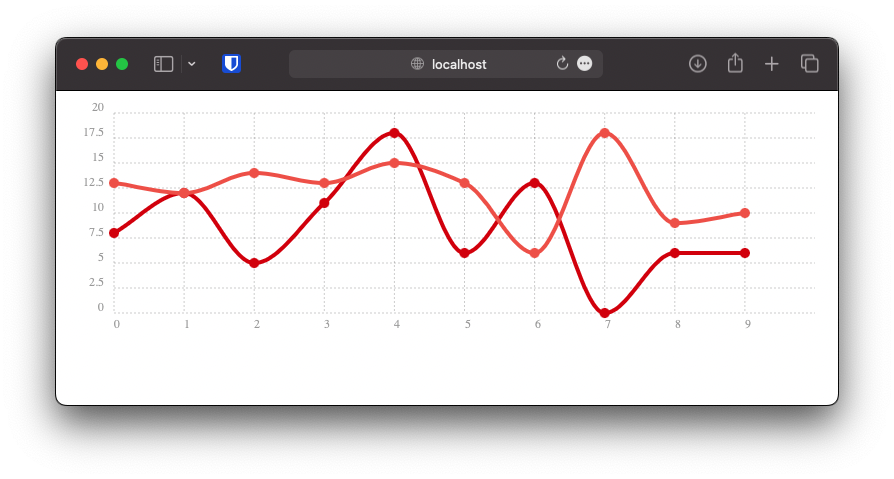

# Examples

This directory contains two example how to use the tooltip plugin.

Both should yield the same result.



## [parcel](parcel)

This example uses the build tool [parcel](https://parceljs.org) to load Chartist and the plugin.

```bash 
# Switch to the parcel example folder 
cd parcel
# Install all dependencies
yarn install
# Start 
yarn run serve
```

View the result on [localhost:1234](http://localhost:1234).

## [static](static)

This example is simply a static HTML file which loads all required assets from [unpkg](https://unpkg.com).

Just open the file [static/index.html](static/index.html) in your web browser of choice. 

